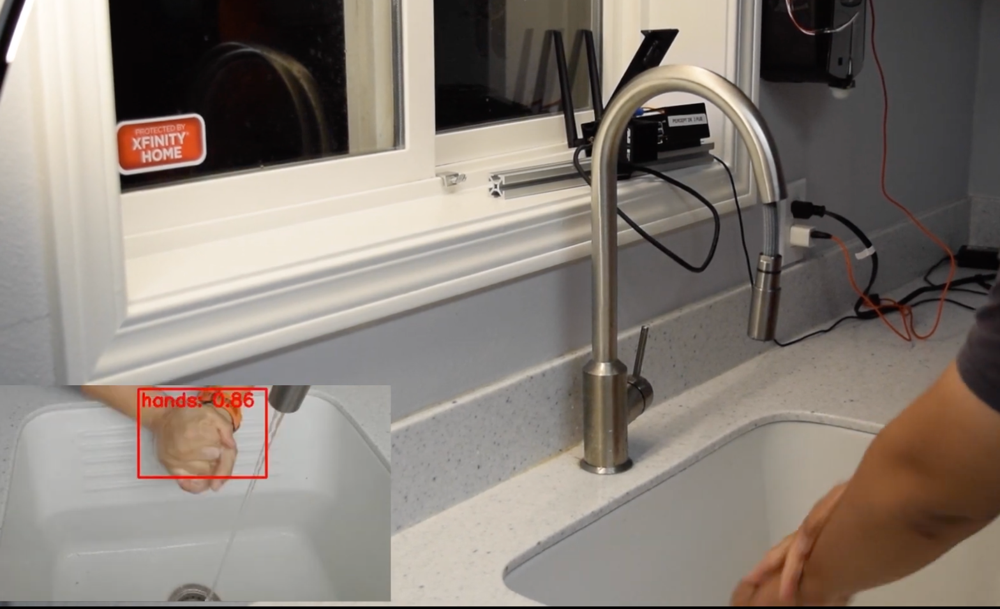
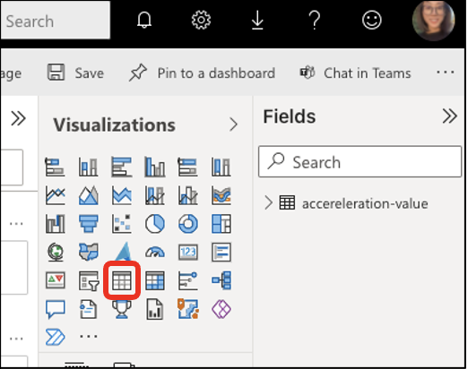

# hand-hygiene-compliance-with-azure-percept

Did you know that each year in the United States about 75,000 people will die from a hospital acquired infection? Think about it, that is more than 200 people every single day.

The goal of this project is to be able to detect if users washed their hands for over 20 seconds using Azure Custom Vision and Azure Percept Vision.




## Prerequisites
- Percept DK ([Purchase](https://www.microsoft.com/en-us/store/build/azure-percept/8v2qxmzbz9vc))
- Azure Subscription : [Free trial account](https://azure.microsoft.com/en-us/free/)
- An Azure Container Registry repository or create it by following [here](https://docs.microsoft.com/en-us/azure/iot-edge/tutorial-develop-for-linux?view=iotedge-2020-11#create-a-container-registry)
- Docker for image building

## Solution Architecture


## Device setup
1. Follow [Quickstart: unbox and assemble your Azure Percept DK components](https://docs.microsoft.com/en-us/azure/azure-percept/quickstart-percept-dk-unboxing) and the next steps.


## Content

| File             | Description                                                   |
|-------------------------|---------------------------------------------------------------|
| `readme.md`             | This readme file                                              |
| `deployment.template.json`    | The delopyment the edge modules of this Smart Plug Solution |
| `envtemplate`    | The list of the enviroment varialbes for .env use |


## Steps
1. Create an Azure Container Registry as in [here](https://docs.microsoft.com/en-us/azure/container-registry/container-registry-get-started-portal)

2. Get the registry info including `username`, `password`, and `login server` as in [here](https://docs.microsoft.com/en-us/azure/container-registry/container-registry-tutorial-prepare-registry#enable-admin-account)

3. Create a file named `.env` in this folder based on `envtemplate`. Provide values for all variables.

4. Create your own hands detection model and deploy it to DK as in here

5. Visit the [evaluatemodule folder](https://github.com/leannhuang/hand-hygiene-compliance-with-azure-percept/tree/main/modules/evaluatemodule) to deploy edge modules on your edge device

6. Add a consumer group to your IoT hub [here](https://docs.microsoft.com/en-us/azure/iot-hub/iot-hub-live-data-visualization-in-power-bi#add-a-consumer-group-to-your-iot-hub)

7. Create Stream Analytics Service [here](https://docs.microsoft.com/en-us/azure/iot-hub/iot-hub-live-data-visualization-in-power-bi#create-a-stream-analytics-job)

8. Add an input to the Stream Analytics job [here](https://docs.microsoft.com/en-us/azure/iot-hub/iot-hub-live-data-visualization-in-power-bi#add-an-input-to-the-stream-analytics-job)

9. Add an output to the Stream Analytics job [here](https://docs.microsoft.com/en-us/azure/iot-hub/iot-hub-live-data-visualization-in-power-bi#add-an-output-to-the-stream-analytics-job)

10. Configure the SQL query of the Stream Analytics [here](https://docs.microsoft.com/en-us/azure/iot-hub/iot-hub-live-data-visualization-in-power-bi#configure-the-query-of-the-stream-analytics-job)

    Replace the `SQL query` below and fill in the corresponding values
    ```
        SELECT
            *
        INTO
            [YourOutputAlias]
        FROM
            [YourInputAlias]
        WHERE Duration IS NOT NULL
    ```

11. Run the Stream Analytics job [here](https://docs.microsoft.com/en-us/azure/iot-hub/iot-hub-live-data-visualization-in-power-bi#run-the-stream-analytics-job)
   
12.  Create and publish a Power BI report to visualize the data  [here](https://docs.microsoft.com/en-us/azure/iot-hub/iot-hub-live-data-visualization-in-power-bi#create-and-publish-a-power-bi-report-to-visualize-the-data) from step 1~5
    
- On the `Fields` pane, expand the table that you specified when you created the output for the Stream Analytics job.
- Drag `EventEnqueuedUtcTime` to Axis on the Visualizations pane.
- Drag `Duration` to Values.
- Select `Table` chart in the `Visualizations` pane
  
    
- Save the report.
    
### Credits and references
- [Azure Percept documentation](https://docs.microsoft.com/en-us/azure/azure-percept/)
