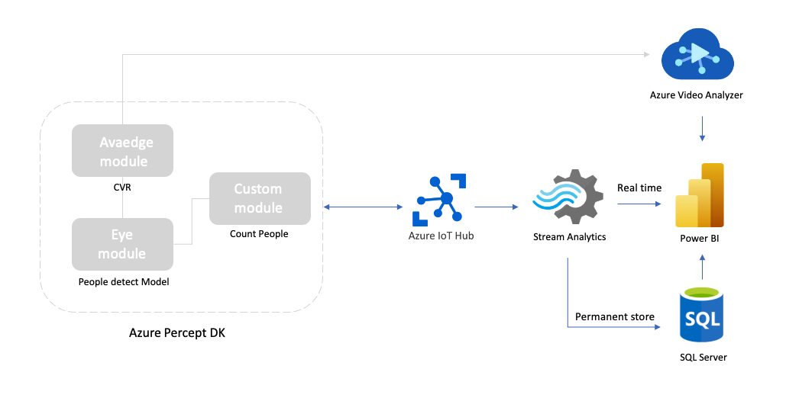
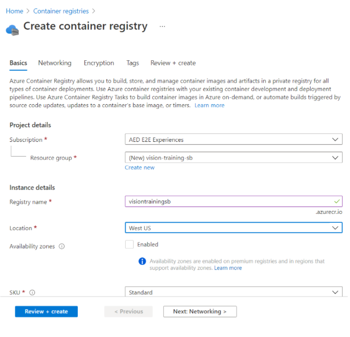
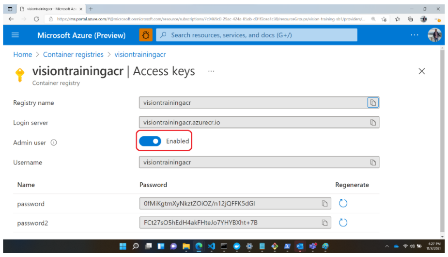
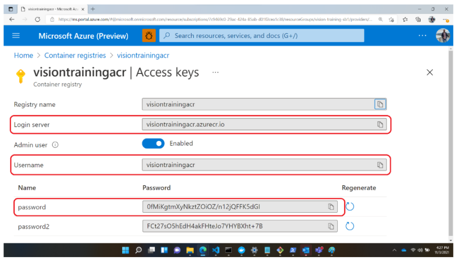
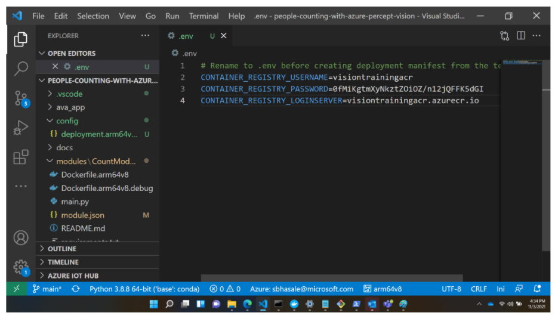
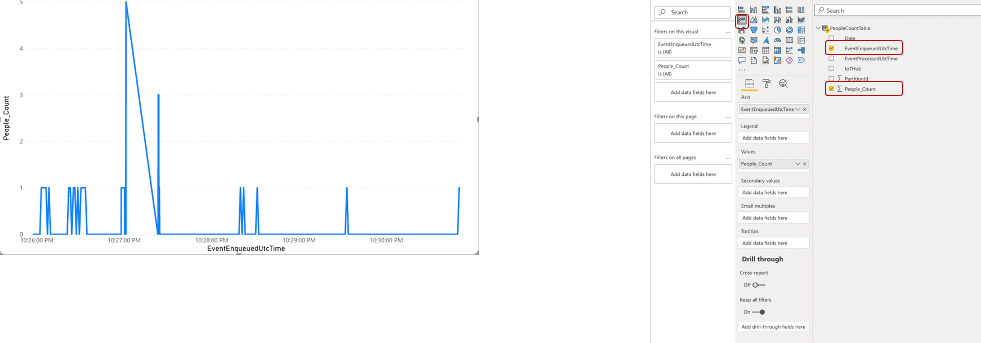
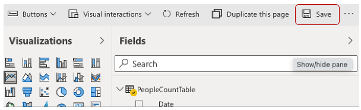

# people-counting-with-azure-percept-vision
Detect and count the people using the Percept DK hardware, Azure IoT Hub, Stream Analytics, and Power BI dashboard

The goal of this project is to be able to detect and count the people with Percept DK advice and show the figure in Power BI dashboard.


## Solution Architecture


- Input : Video stream from Azure Percept DK

- Output: Count of people in Power BI dashboard 
  
    

## Future work:
- Add the steps in README to activate the AVA pipeline 
- Create the SQL server and design the data schema 
- Design the Power BI dashboard and embed the recording video from the AVA portal



## Prerequisites
- Percept DK ([Purchase](https://www.microsoft.com/en-us/store/build/azure-percept/8v2qxmzbz9vc))
- Azure Subscription : ([Free trial account](https://azure.microsoft.com/en-us/free/))
- Power BI subsription: ([Try Power BI for free](https://go.microsoft.com/fwlink/?LinkId=874445&clcid=0x409&cmpid=pbi-gett-hero-try-powerbifree))
- Power BI workspace: ([Create the new workspaces in Power BI](https://docs.microsoft.com/en-us/power-bi/collaborate-share/service-create-the-new-workspaces#create-one-of-the-new-workspaces))
- [Azure Percept DK setup experience](https://docs.microsoft.com/en-us/azure/azure-percept/quickstart-percept-dk-set-up): you connected your devkit to a Wi-Fi network, created an IoT Hub, and connected your devkit to the IoT Hub
- Download and install [VS Code]()
- Download and install [Git]()
- Install the IoT Hub Extension in VS Code
- Install the Azure IoT Tools Extension in VS Code
- Download and install [Docker Desktopn]() (Will require a PC reboot)
- (Only for Windows Users) Install WSL2 by running the following commands in Windows PowerShell or Terminal (on MacOS) (Will require a PC restart)

    `wsl --install`

    `wsl --set-default-version 2`
  

## Set up your Azure Percept DK and Vision
1. Follow [Quickstart: unbox and assemble your Azure Percept DK components](https://docs.microsoft.com/en-us/azure/azure-percept/quickstart-percept-dk-unboxing) and the next steps.
2. Connect the camera module to the Azure Percept DK via the USB-C cable.
3. Open Command Prompt (for Windows) or Terminal (on MacOS) and execute the command-

    `git clone https://github.com/microsoft/Azure-Percept-Reference-Solutions.git` 

    Within the cloned repository go to `people-counting-with-azure-percept-vision` directory.


## Content

| File             | Description                                                   |
|-------------------------|---------------------------------------------------------------|
| `readme.md`             | This readme file                                              |
| `deployment.template.json`    | The delopyment the edge modules of this people counting Solution |
| `envtemplate`    | The list of the enviroment varialbes for .env use |

## Step 1: Create a Container Registry resource 
1. Login to Azure Portal https://portal.azure.com/
2. To create a Container Registry, go to [Create container registry - Microsoft Azure](https://ms.portal.azure.com/#create/Microsoft.ContainerRegistry)

    a. Select your Azure Subscription in the `Subscription` drop down box 

    b. Select your preferred resource group from the `Resource group` drop down menu. If you would like to create a new resource group to use with your voice assistant, click `Create new` under the dropdown menu and follow the prompts

    c. Provide a unique `Registry Name`

    d. Under `Location`, select the region to deploy resource (We suggest select `West US`) 

    e. `Availability Zones` - disabled

    f. For `SKU`, select `Standard`  

    g. Keep all other tab as default and click `Review + create` at the bottom of the screen. Once the validation passes, click `Create`. This will create your Container Registry. 

    
3. After successful resource deployment go to your container registry resource. On the left scroll panel select `Access Keys` under `Settings` and `enable` the `Admin user` 
    
4. Make a note of the `Login Server`, `Username`, and `password` 
    
5. Go to the git repository and `people-counting-with-azure-percept-vision` directory and rename `envtemplate` to `.env`. Open the file and fill in the following details-

    a. CONTAINER_REGISTRY_USERNAME= your container registry Username

    b. CONTAINER_REGISTRY_PASSWORD= your container registry Password

    c. CONTAINER_REGISTRY_LOGINSERVER= your container registry Login Server

    

## Step 2: Deploy Edge modules on your Edge Device
Go to the [CountModule folder](https://github.com/microsoft/Azure-Percept-Reference-Solutions/tree/main/people-counting-with-azure-percept-vision/modules/CountModule) to deploy edge modules on your edge device.

## Step 3: Add a Consumer group to your IoT Hub
Consumer groups provide independent views into the event stream that enable apps and Azure services to independently consume data. 
Add a consumer group to your IoT hub [here](https://docs.microsoft.com/en-us/azure/iot-hub/iot-hub-live-data-visualization-in-power-bi#add-a-consumer-group-to-your-iot-hub)

## Step 4: Set up Stream Analytics
1. Create Stream Analytics Service [here](https://docs.microsoft.com/en-us/azure/iot-hub/iot-hub-live-data-visualization-in-power-bi#create-a-stream-analytics-job)
2. Add an input to the Stream Analytics job [here](https://docs.microsoft.com/en-us/azure/iot-hub/iot-hub-live-data-visualization-in-power-bi#add-an-input-to-the-stream-analytics-job)
3. Add an output to the Stream Analytics job [here](https://docs.microsoft.com/en-us/azure/iot-hub/iot-hub-live-data-visualization-in-power-bi#add-an-output-to-the-stream-analytics-job)
4. Configure the SQL query of the Stream Analytics [here](https://docs.microsoft.com/en-us/azure/iot-hub/iot-hub-live-data-visualization-in-power-bi#configure-the-query-of-the-stream-analytics-job)

    Replace the `SQL query` below and fill in the corresponding values
    ```
        SELECT
            *
        INTO
            [YourOutputAlias]
        FROM
            [YourInputAlias]
        WHERE People_Count IS NOT NULL
    ```

5. Run the Stream Analytics job [here](https://docs.microsoft.com/en-us/azure/iot-hub/iot-hub-live-data-visualization-in-power-bi#run-the-stream-analytics-job)

## Step 5: Create and publish a PowerBI report to visualize data
Create and publish a Power BI report to visualize the data [here](https://docs.microsoft.com/en-us/azure/iot-hub/iot-hub-live-data-visualization-in-power-bi#create-and-publish-a-power-bi-report-to-visualize-the-data) 

- On the `Fields` pane, expand the table that you specified when you created the output for the Stream Analytics job.
- Drag `EventEnqueuedUtcTime` to Axis on the Visualizations pane.
- Drag `People_Count` to Values.



- A line chart is created. The x-axis displays date and time in the UTC time zone. The y-axis displays count of the people from the Percept DK.
- Save the report.
    


## Summary
In this reference solution you created a people detection and counting solution using Azure Percept DK and the Azure Percept Vision module. You used PowerBI dashboard to visualize the results.
    
## Credits and references
- [Tutorial: Visualize real-time sensor data from Azure IoT Hub using Power BI](https://docs.microsoft.com/en-us/azure/iot-hub/iot-hub-live-data-visualization-in-power-bi#create-a-stream-analytics-job)
- [Message handler sample code](https://github.com/Azure/azure-iot-sdk-python/blob/master/azure-iot-device/samples/async-edge-scenarios/receive_data.py)
