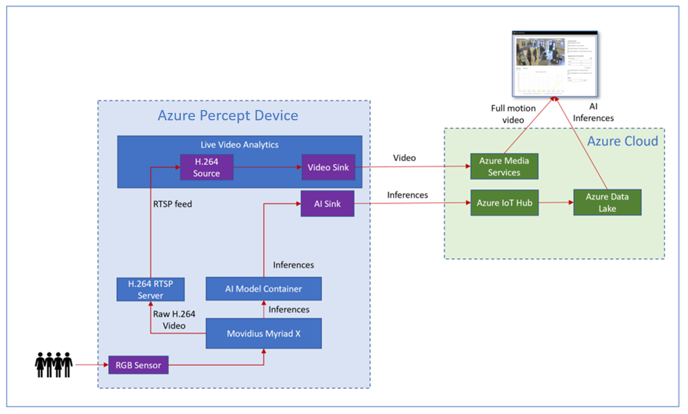
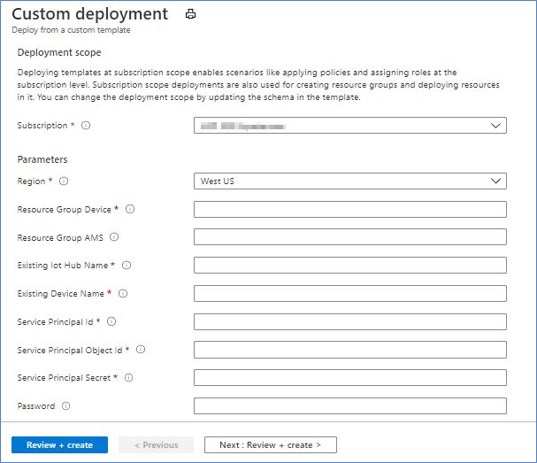
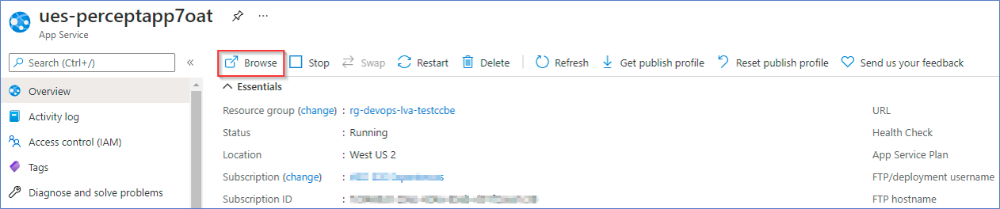

# Open Source People Counting AI Application
			
## Overview

This is an open source Percept AI application providing edge-based people counting with user-defined zone entry/exit events. Video and AI output from the on-prem edge device is egressed to Azure Data Lake using Azure Media Service and IoT Hub, with the user interface running as an Azure Website. AI inferencing is provided by Azure Percept for people detection:

## Physical hardware app topology

### Device Requirements
This application can execute with a physical Percept AI Devkit with Vision SOM.

# Installation Details
This reference open source application showcases best practices for AI security, privacy and compliance.  It is intended to be immediately useful for anyone to use with their Percept AI device. 

## Prerequisites
- A service principal with an object id, app id, and secret is required in order to deploy the solution. Please ensure you have the appropriate rights to create such a service principal, or contact your Azure Active Directory Administrator to assist you in creating one. You can follow this [how-to guide](https://docs.microsoft.com/en-us/azure/active-directory/develop/howto-create-service-principal-portal) to create the required service principal.

- You must have Owner access on the Azure subscription you wish to deploy to

- To install this application you must have Owner level access to the target subscription.  This deployment will create resources within the following Azure namespaces. These resource providers must be enabled on the subscription.
    * Microsoft.Devices
    * Microsoft.Authorization
    * Microsoft.ContainerInstance
    * Microsoft.ManagedIdentity
    * Microsoft.Web
    * Microsoft.Storage
    * Microsoft.Resources
    * Microsoft.Media

- Azure Percept Devkit with Vision SOM attached

- You should have already completed the [OOBE instructions](https://github.com/microsoft/Project-Santa-Cruz-Preview/blob/main/user-guides/getting_started/oobe.md). Please make note of the following details as they will be required for deployment.
    * Region of IoT Hub
    * Resource group name which contains your IoT Hub
    * IoT Hub Name
    * Edge device name

---

## App Deployment
Deployment starts with this button. Please reference the below details for populating the requested deployment information.

This will redirect you to the Azure portal with this deployment page:

#

To deploy the solution to your Azure Percept with Vision SOM, please enter the following parameters:

| Parameters | Description |
| ------ | ------ |
| __Region__ | Name of the region which host your existing Azure IoT Hub. |
| __Resource Group Device__ | Name of the resource group which host your Azure IoT Hub connected to Azure Percept device. |
| __Resource Group AMS__ | Unique name of a new resource group to host Azure Media Service, Azure Data Lake and Front End application. |
| __Existing IoT Hub Name__ | Name of a the IoT Hub that your Azure Percept device is registered as an edge device. |
| __Existing Device Name__ | Name of the IoT Edge device in IoT Hub which is connected to Azure Percept device. |
| __Service Principal Id__ | Id of an existing Service Principal which will be used in Azure Media Service. |
| __Service Principal Object Id__ | Object Id of an existing Service Principal which will be used in Azure Media Service. |
| __Service Principal Secret__ | Secret of an existing Service Principal which will be used in Azure Media Service. |
| __Password__ | A password to protect access to the web app which visualizes your output. A best practice is to assign a password to prevent others on the internet from seeing the testing output of your Percept AI device. |

Once deployment is complete, you can launch the web application by navigating to the `Resource Group AMS` name selected above. You will see an Azure Web Services deployment which starts with `ues-perceptapp` followed by 4 random characters. Select this app, then chose the `Browse` button in the top left:

Once the application loads, you will need to enter the password you entered at deployment time. The password is cached for subsequent visits to the same application.

# People Counting in a Zone

You can create a polygon region in the camera frame to count the number of people in the zone.  Metrics are displayed at the bottom showing total people in the frame vs. people in the zone.  To create a zone, click anywhere on the video window to establish the first corner of your polygon. Clicking 4 times will create a 4-sided polygon. People identified in the zone are shown with a yellow highlight.  Press the `Clear` button in the lower right to clear your zone definition.

## Additional App Details

Please see the [frontend-app documentation](frontend-app/app/README.md) for addition details on configuring and using the frontend application.

---
# Troubleshooting Common Deployment Errors
Please visit the [Troubleshooting Guide](docs/deployment-troubleshooting-guide.md) for debugging common deployment errors.
