# Debugging ARM Template Deployment Errors
- **Common Validation Errors**
  - Access Permission issue: 

    The User must have Owner level access to the target subscription, as this deployment will create resources within the following Azure namespaces.

    A user without appropriate access permissions trying to deploy the solution will face the validation failure issue as below 

    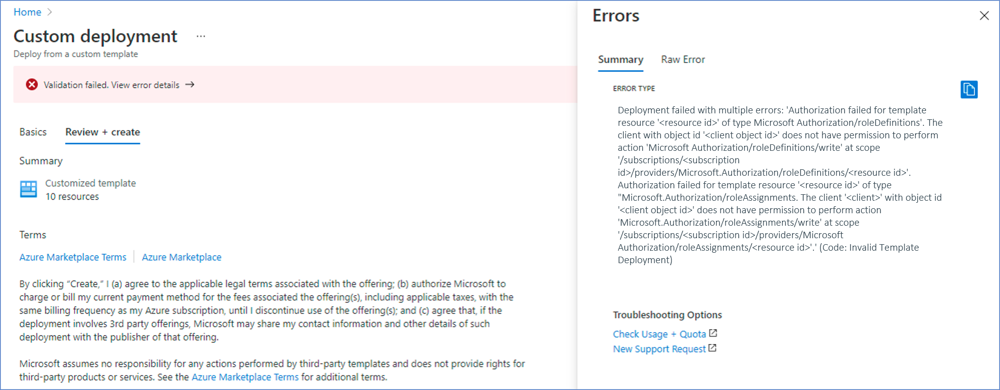
  
    you could take a look at Prerequisites provided in [README](../README.md) 

  - Invalid Resource location: 

    This validation error occurs when a user specifies different region for ARM template deployment than the existing IoT Hub region.

    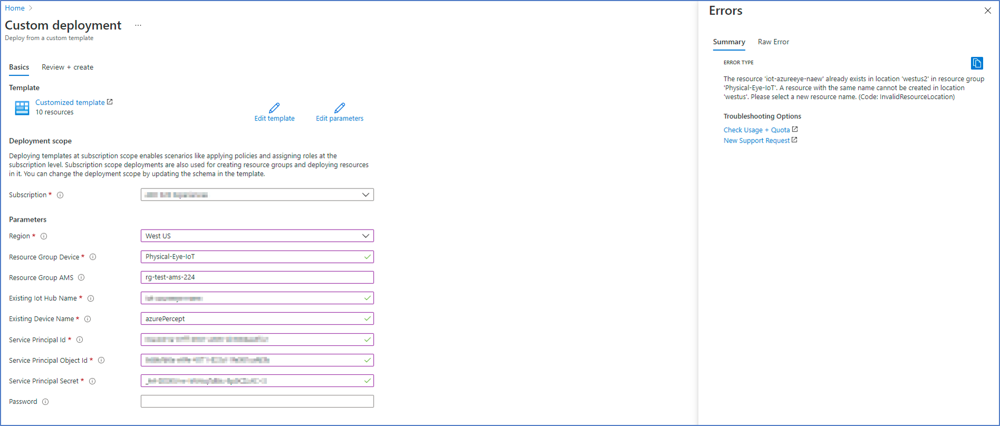
  
    To resolve this error, user must provide same region for ARM template deployment as existing IoT Hub region. 

  - Required Parameters missing:

    The Parameters Resource Group Device, Existing Iot Hub and Device Name, service principal with an object id, app id, and secret is required in order to deploy the solution

    If in case value for any required parameter is left Blank, a Validation failed error is generated.

    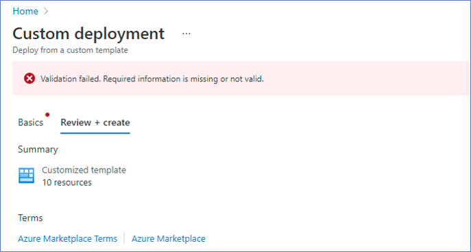

   - Required Parameters value not valid:

     There are certain naming restrictions while creating resources, invalid characters, maximum length exceeded are among them.
     
      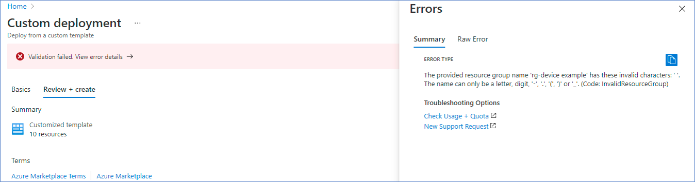

     You must follow naming restrictions while passing value to these parameters.
     1. No special characters, spaces must be included in parameter values, The resource group name can only be a letter, digit, '-', '.', '(', ')' or '_'.
     2. Maximum character length for resource group name is 90 characters.    

     
- **Deployment Script Errors**
Below are the steps listed to debug ‘DeploymentScriptError’ issues incase of ARM Template Deployment failure:

   These steps could be followed to debug any issues occurred while Executing the Deployment Script. 

  1. Locate the resource group:
   Locate the resource group where the deployment is targeted, it could be ‘Resource Group Device’ or ‘Resource Group AMS’ that you had provided in ARM template, where the Deployment Script is executed.
   
   
     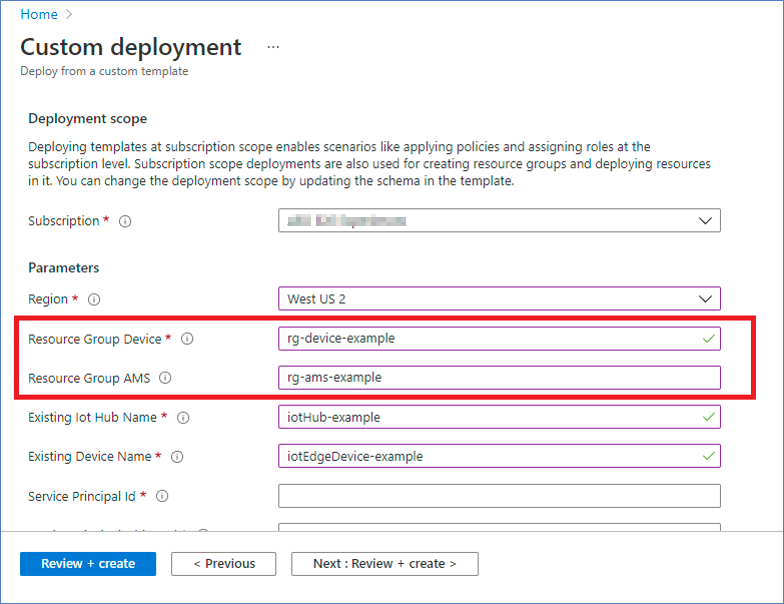

     Incase of Deployment failure, you can navigate to the Resource Group where the Deployment Script was executed.
   
     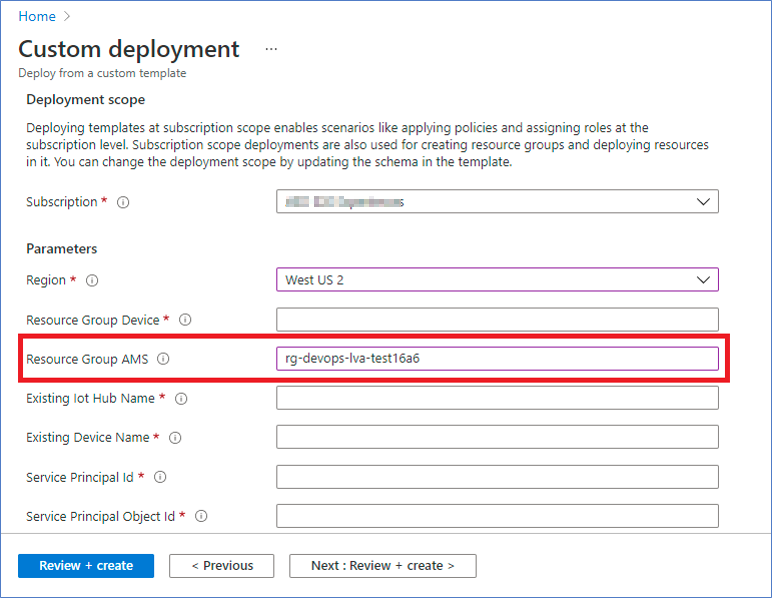
   
     Once you select the Resource Group, under Resources section you will be able to see the resources deployed.

  2. Navigate to the resource:
   In the Resources section, scroll until You see an deployment, where Resource Type would be ‘Deployment Script’ under the same resource group as above,
   Select this deployment.
   
     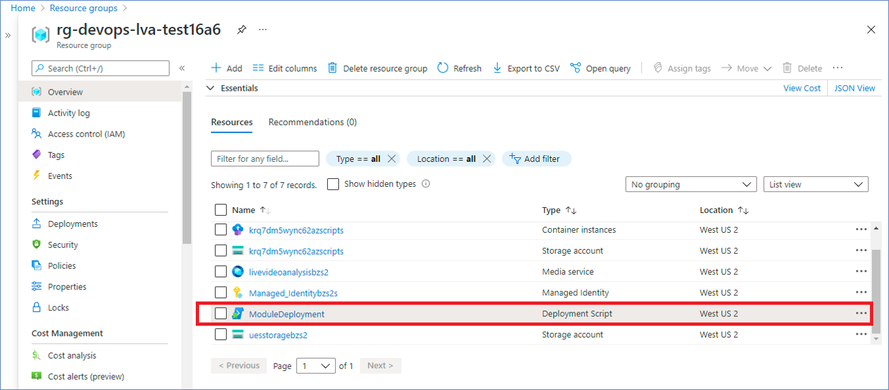
   
  3. Navigate into Logs:
    Once you browse into the Deployment Script resource, under Overview section you will be able to find Logs for the Script Executed.
   
     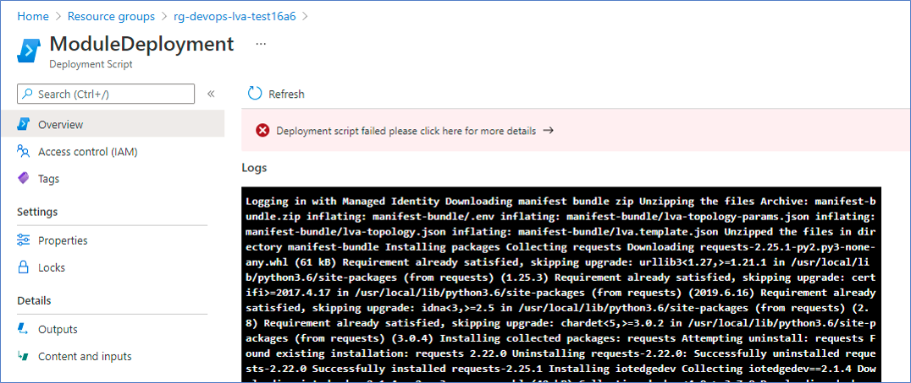

     You can now click on Logs and scroll to the end. It should contain the actual error that occurred in Deployment Script.
  
     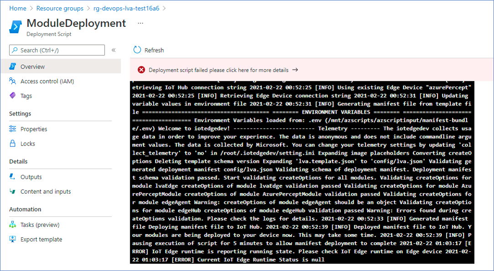

- **DeploymentScriptBootstrapScriptExecutionFailed**
	
	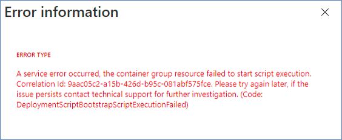

	This occurs whenever bootstrap script throws an error. Bootstrap script is the system script that orchestrates the deployment script execution. 
	 In such case, try to redeploy the solution.

- **Role Definition Failure**
	
    This occurs when the Role Definition with same Name already Exists, and user tries to update the Role Permissions for existing Definition.

	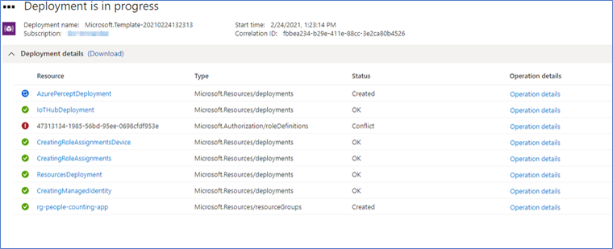  
    Error message for this failure will be as below 
  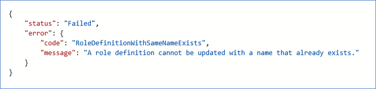

	you could resolve this issue, by using non-existing name for Role Definition creation.

- **Creating Role Assignment Conflict**

  This Conflict occurs when an user tries to redeploy the solution, using an existing Resource Group where Managed Identity and Role was earlier assigned to this Identity's Principal ID and later that if Identity got deleted still the Role with same name exists in the Resource Group and associated Identity's Principal ID are not allowed to be updated.

  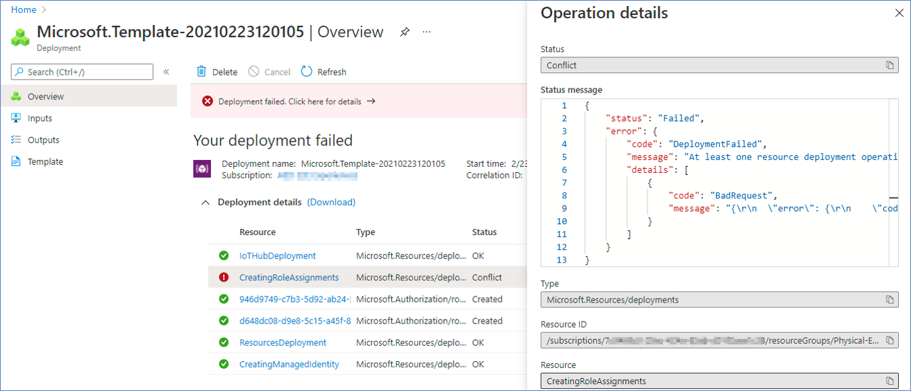
  
   Status message looks like below where code would be "RoleAssignmentUpdateNotPermitted" with message as "Tenant ID, application ID, principal ID, and scope are not allowed to be updated".

  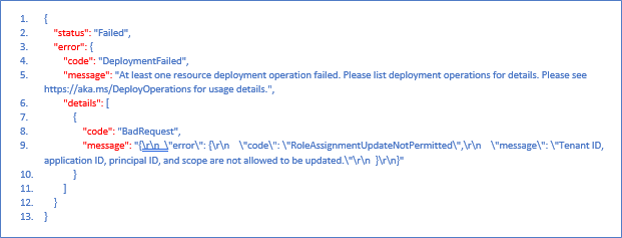

  The Resolution over this conflict would be, if Managed Identity got deleted from Resource Group then delete the Role assigned to it as well, and retry the deployment.
