# People Counting Solution with Percept DK and Azure Video Analyzer

## Overview
The goal of this project is to be able to recognize and count people found on the edge with the Percept Devkit device and Vision SoM camera using Azure Video Analyzer (AVA) as the platform. This video is saved to the cloud with AVA when invoking methods that directly communicate with the edge device for continuous recording.

Currently this repo offers- 

* Process to deploy Azure Video Analyzer (and Azure Resources), plus edge modules, to the Percept DK and initiate cloud recording 

* Azure Web Application to visualize the video stream and see a graphical representation of the people counting in each frame 

## Prerequisites
* Azure Percept Devkit - [Purchase](https://www.microsoft.com/en-us/store/build/azure-percept/8v2qxmzbz9vc)
* Azure Subscription - [Free Trial Account](https://azure.microsoft.com/en-us/free/)
* Visual Studio Code - [Download](https://code.visualstudio.com/Download)
* [Optional - for debugging] Python 3.6+ (Preferably an [Anaconda](https://docs.anaconda.com/anaconda/index.html) release)

# Manual Set up steps
> Note: For Automatic deployment scroll down to **Deploy Azure resources** section

## Device Setup
Follow [Unbox and assemble your Azure Percept Devkit components](https://docs.microsoft.com/en-us/azure/azure-percept/quickstart-percept-dk-unboxing) to setup your device

## Download code from GitHub

`git clone https://github.com/microsoft/Azure-Percept-Reference-Solutions.git`

The code used in this reference solution is in `percept-dk-ava-samples` folder

## Create the Azure Video Analyzer Resource
1. Sign in to the [Azure Portal](https://portal.azure.com)
2. On the serach bar at the top, enter **Video Analyzer**
3. Select **Video Analyzers** under **Services**
4. Select **Add**
5. In the **Create Video Analyzer account** section, enter the required values
6. Select **Review + create** at the bottom of the form
7. Note dowm your **Subscription** and **Resource Group** for further use
8. Click **+ Add edge** modules under Egde modules, type a module name
9. Copy the AVA **provision token** for further use

## Deploy the Eye Module
1. Open Visual Studio Code
2. Select the **AZURE IOT HUB** tab and click **Select IoT Hub**

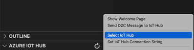


3. Select your subscription
4. Select your IoT Hub
5. Check your device has been connected to the Azure IoT Hub


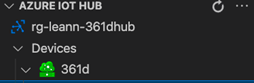

## Generate Manifest and deploy to Percept Devkit
1. Click deploy folder > edge folder > envtemplate
2. Rename file **envtemplate** to **.env**
3. Fill in the subscription id, resource group, and AVA provision token that you noted down in the previous section
4. Right click the **deployment.ava.percept.template.json** and click **Generate IoT Edge Deployment Manifest**. After that, you will see **deployment.ava.percept.template.json** under the **config** folder

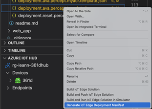


5. Right click the **deployment.ava.percept.amd64.json** and click **Create Deployment for Single Device** and choose your device

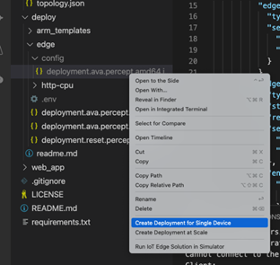

6. Check the Modules under Devices to see if **$edgeAgent**, **$edgeHub**, **azureeyemodule**, and **avaedge** are successfully deployed (running)

## Create an App Service on the Azure Portal
1. Sign in to the [Azure Portal](https://portal.azure.com)
2. On the search bar at the top, enter **App Services** 
3. On the **App Serivces** blade, select **+ Create**
4. Enter the following details -
    * **Subscription** - Your Azure Subscription
    * **Resource Group** - Your existing Resource Group, or you may create a new one
    * **Name** - Unique name for your Web Application
    * **Publish** - Select the **Code** option
    * **Runtime stack** - Select **Node 14 LTS**
    * **Operating System** - Select **Windows**
    * **Region** - Select a region to deploy the resource
    * **App service plan** - Select existing or create a new App Service plan
    * **Sku and size** - Standard S1
5. Select **Review + create** at the bottom of the form
6. Ensure that your deployment is successful 

## Create JSON Web Token (JWT)
Before starting this section - Download and install [.NET Core SDK](https://dotnet.microsoft.com/download/dotnet/3.1) 

JWT is required for the Web Application to use the Azure Video Analyzer player widget
1. Clone the AVA C# samples [repository](https://github.com/Azure-Samples/video-analyzer-iot-edge-csharp)
2. Go to the **src/jwt-token-issuer** folder, and find the **JWTTokenIssuer** application 
3. Open Visual Studio Code, then go to the folder where you downloaded the **JWTTokenIssuer** application. This folder should contain the ***.csproj** file
4. On line 77, change the audience to your Azure Video Analyzer endpoint, followed by **/videos/***. It should look like the following- 

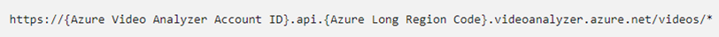
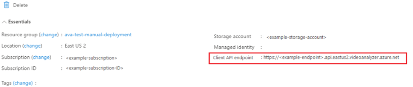

Note - You can find the Video Analyzer endpoint in the overview section of the Video Analyzer resource in the Azure Portal. This value is referenced as **Client API endpoint** 

5. On line 78, change the issuer to the issuer value of your certificate (for example, https://contoso.com) 
6. Open a Command Prompt window and go to the folder with the **JWTTokenIssuer** files. Run the following two commands - ```dotnet build``` followed by ```dotnet run``` 

After the application runs, it creates a self-signed certificate and generates the JWT information from that certificate. 

JWTTokenIssuer creates the JWT and the following components - Issuer, Audience, Key Type, Algorithm, Key Id, RSA Key Modulus, RSA Key Exponent, Token 

Note - 
* The Token generated is the JWT 
* Copy these values for later use


## Create an Access Policy
Access policies define the permissions and duration of access to a particular video stream 
1. Sign in to the [Azure Portal](https://portal.azure.com) and go to the Resource Group where your Azure Video Analyzer is located 
2. Select the Azure Video Analyzer resource 
3. Under **Video Analyzer**, select **Access Policies**
4. Select **New**, and enter the following information-
    * **Access policy name** - You may choose any name
    * **Issuer** - This value must match the JWT issuer
    * **Audience** - Use default value
    * **Algorithm** - The supported values are RS256, RS384, and RS512. Use the value of **Algorithm** from the previous section
    * **Key ID** - This ID is generated from your certificate. Use the value of **Key ID** from the previous section
    * **RSA Key Modulus** - This value is generated from your certificate. Use the value of **RSA Key Modulus** from the previous section
    * **RSA Key Exponent** - This value is generated from your certificate. Use the values of **RSA Key Exponent** from the previous section

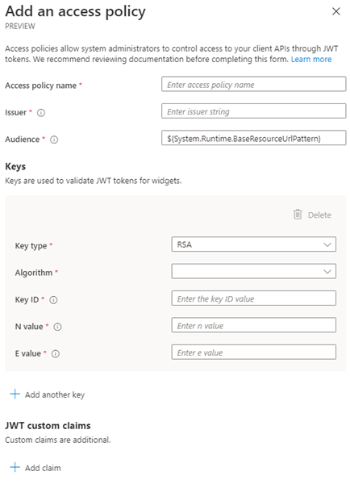

5. Select **Save**


## Add Configuration to the App Service
1. Sign in to the [Azure Portal](https://portal.azure.com) and go the Resource Group where your Azure App Service is located
2. Select the App Service resource
3. Under **Settings** select **Configuration**
4. Add the following Application settings by using the **+ New application** setting button
    * **CLIENT_API_ENDPOINT_URL**
        * Value - This is the Video Analyzer endpoint. You can find it in the overview section of the Video Analyzer resource in the Azure Portal
    * **DEVICE_NAME**
        * Value - This is the name of your Azure Percept DK
    * **IOTHUB_CONNECTION_STRING**
        * Value - This is the connection of your IoT Hub which contains the Azure Percept device. You can find this in your IoT Hub resource under **Shared access policies**. Use the **Primary connection string** associated with the **iothubowner** policy name 
    * **JWT_TOKEN**
        * Value - Use the **Token** value that we generated in a previous section
    * **VIDEO_NAME**
        * Value - Use the video name that you want the Azure Video Analyzer widget to access

## Set up CVR Pipeline
1. Python Setup
    * Open Command Prompt or Click Terminal at the bottom of the VS Code window
    * Using the `cd` command go to the folder containing the `requirements.txt` file
    * Enter command `pip install -r requirements.txt`
2. Fill in the Connection String and Device ID in `appsettings.json`
    * Create a file called `appsettings.json` under the `ava_app` folder
    * Add the following text and provide values for all parameters
    ```Json
    {
        "IoThubConnectionString":"<your iothub connection string>",
        "deviceId":"<device ID>",
        "moduleId":"avaedge"
    }
    ```

## Activate CVR Pipeline
1. Using the `cd` command go to the `ava_app` folder
2. Execute command `python main.py --action start --type cvr`
3. Check the pipeline in the video analyzer extension, you can see CVR-Pipeline has been activated.
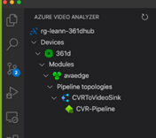

## Deploy the Web App to Azure
1. In the terminal, make sure you are in the project folder, then start Visual Studio Code with the following command- `code .` 
2. In the Visual Studio Code activity bar, select the Azure logo to show the **AZURE APP SERVICE** explorer. Select **Sign into Azure...** and follow the instructions Once signed in, the explorer should show the name of your Azure subscription.

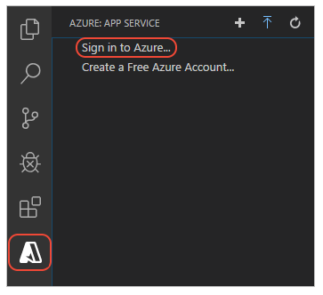

3. Under your Subscription, you can drop down to see your App Service that we created in the previous section
4. To deploy, right click on the App service and select **Deploy to Web App...** option, then select the Web App directory 
5. Once deployment is successful, go to the App service resource on the Azure Portal. On the **Overview** panel check the **Status** of the service is **Running**. You can access the application by clicking the **URL** or the **Browse** button at the top 

## Deactivate CVR Pipeline
1. Using the `cd` command go to the `ava_app` folder
2. Execute command `python main.py --action stop --type cvr`
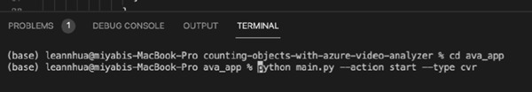
3. Check the pipeline in the video analyzer extension, you can see CVR-Pipeline has been deactivated
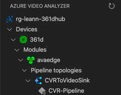

## Troubleshooting
* [Azure Video Analyzer Troubleshooting Page](https://docs.microsoft.com/en-us/azure/azure-video-analyzer/video-analyzer-docs/troubleshoot)
* _The module cannot access the path /var/lib/videoanalyzer/AmsApplicationData specified in the 'applicationDataDirectory' desired property_. This may occur due to previous deployments of AVA where the application data directory was populated with files. To refresh this directory you will need to stop the iotedge daemon, delete and then recreate the directory as follows.
```
sudo systemctl stop iotedge
sudo rm -fr /var/lib/videoanalyzer/AmsApplicationData
sudo mkdir /var/lib/videoanalyzer/AmsApplicationData
sudo chown -R 1010:1010 /var/lib/videoanalyzer/
sudo systemctl start iotedge
```
> Note:  for newer iotedge daemons you may need to replace `iotedge` command with `aziot-edged`.

# Deploy Azure Resources
> **IMPORTANT**: The following "Deploy to Azure" button will provision the Azure resources listed below and you will begin incurring costs associated with your network and Azure resources immediately as this solution faciliates continuous video recording to the cloud.  To calculate the potential costs, you may wish to use the [pricing calculator](https://azure.microsoft.com/en-us/pricing/calculator/) before you begin and/or have a plan to test in a single resource group that may be deleted after the testing is over.


After the script finishes you will have the following Azure resources in a new Resource Group in addition to your existing IoT Hub you specified:

* [Storage Account](https://docs.microsoft.com/azure/storage/common/storage-account-overview) 
* [Azure Video Analyzer](https://docs.microsoft.com/azure/azure-video-analyzer/overview)
    * With an active pipeline for video recording running
* [Container Registry](https://docs.microsoft.com/en-us/azure/container-registry/)
* [Managed Identities](https://docs.microsoft.com/azure/active-directory/managed-identities-azure-resources/overview)
* [Azure App Service](https://docs.microsoft.com/en-us/azure/app-service/overview)

> **IMPORTANT**:  To be able to redeploy the AVA modules, you should keep the AVA Provisioning Token for your records (this can not be found after redeploying with alternative deployment manifests).  After deployment, go to the specified IoT Hub (probably in a different resource group) --> IoT Edge --> your device name --> avaedge Module --> Module Identity Twin --> in "properties" --> "desired" --> copy and save "ProvisioningToken".

To view your People Counting application go to your Resource Group, select the App Service you just created and click `Browse` or click the `URL`

## Credits and References
* [Azure Percept Documentation](https://docs.microsoft.com/en-us/azure/azure-percept/)
* [Azure Video Analyzer Documentation](https://docs.microsoft.com/en-us/azure/azure-video-analyzer/video-analyzer-docs/)

## Additional notes

The Vision SoM on the Percept DK returns json in the format:

```json
{
  "NEURAL_NETWORK": [
    {
      "bbox": [0.404, 0.369, 0.676, 0.984],
      "label": "person",
      "confidence": "0.984375",
      "timestamp": "1626991877400034126"
    }
  ]
}
```

Here, with the simple http server (`simpleserver` module), an advanced feature, we sync it in the correct format for AVA.