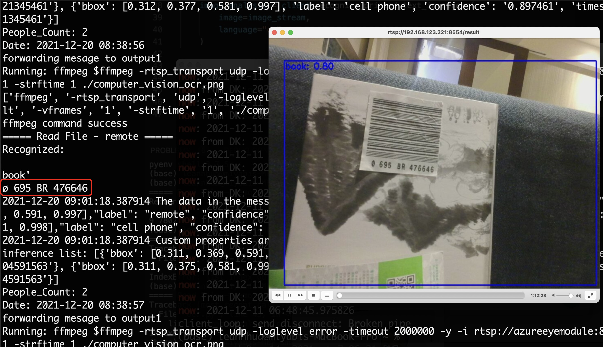

# image-capture-with-ocr
Capture the image when the defined object has been detected and send to Azure cognitive service OCR for further text recognition.

The goal of this sample code is to guide you to capture image of the rtsp stream from Percept DK eye module for further processing.

## Prerequisites
- Percept DK ([Purchase](https://www.microsoft.com/en-us/store/build/azure-percept/8v2qxmzbz9vc))
- Azure Subscription : ([Free trial account](https://azure.microsoft.com/en-us/free/))

## Content

| File             | Description                                                   |
|-------------------------|---------------------------------------------------------------|
| `readme.md`             | This readme file                                              |
| `deployment.template.json`    | The delopyment the edge modules of this image capturing with OCR Solution |
| `envtemplate`    | The list of the enviroment varialbes for .env use |

## Steps
1. Create an Azure Container Registry as in [here](https://docs.microsoft.com/en-us/azure/container-registry/container-registry-get-started-portal)
2. Get the registry info including `username`, `password`, and `login server` as in [here](https://docs.microsoft.com/en-us/azure/container-registry/container-registry-tutorial-prepare-registry#enable-admin-account)
3. Create a file named `.env` in this folder based on `envtemplate`. Provide values for all variables.
4. Create your own object detection model and deploy it to DK as in [here](https://docs.microsoft.com/en-us/azure/azure-percept/tutorial-nocode-vision) (The default machine learning model is the SSD General model provided in the [model zoo](https://github.com/microsoft/azure-percept-advanced-development#model-urls))
   
5. Visit the [CustomModule folder](https://github.com/leannhuang/image-capture-with-ocr/tree/main/modules/CustomModule) to deploy edge modules on your edge device
6. Check the OCR capabilities and limitation as in [here](https://docs.microsoft.com/zh-tw/legal/cognitive-services/computer-vision/ocr-characteristics-and-limitations?context=/azure/cognitive-services/computer-vision/context/context)

7. Use VLC to check the rtsp result stream `rtsp://<ip>:8554/result` to see if the image fits the OCR limitation
   
    

8. Check the log of the custom module 
   
   
