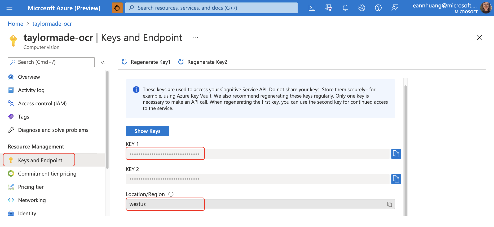
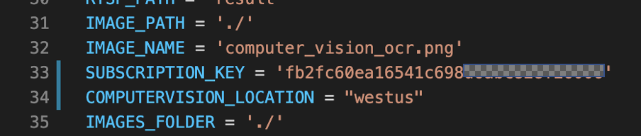

# Edge Deployment
Use this information to deploy people counting modules on your edge device

## Contents 

| File             | Description                                                   |
|-------------------------|---------------------------------------------------------------|
| `readme.md`             | This readme file                                              |
| `Dockerfile.arm64v8`    | The Dockerfile of the custom module                       |
| `main.py`               | The main program file                                         |
| `module.json`           | The config of the custom module                           |
| `requirement.txt`       | List of all dependent Python libraries                        |

## Setup for edge


1. Create a [Computer Vision resource](https://portal.azure.com/#create/Microsoft.CognitiveServicesComputerVision) in the Azure portal to get your subscription key and location. 
   
     

2. Modify the [DEFINED_OBJECT](https://github.com/leannhuang/image-capture-with-ocr/blob/main/modules/CustomModule/main.py#L36) in the `main.py` according to the object you defined in the custom vision

3. Fill in the `SUBSCRIPTION_KEY` and `COMPUTERVISION_LOCATION` in the `main.py`

   


4. Fill your ACR address in `module.json` file (ex: dk361d.azurecr.io/ocr)
```
   "repository": "<Your container registry login server/respository name>"
```

3. Change the Azure IoT Edge Solution Default Platform to `arm64v8` as in [here](https://docs.microsoft.com/en-us/azure/iot-edge/tutorial-develop-for-linux?view=iotedge-2020-11#select-your-target-architecture)
   
4. Build and push your IoT Edge solutions to your private ACR 
use VSCode as in [here](https://docs.microsoft.com/en-us/azure/iot-edge/tutorial-develop-for-linux?view=iotedge-2020-11#build-and-push-your-solution) 

5. Deploy edge modules to device
Use VSCode as in [here](https://docs.microsoft.com/en-us/azure/iot-edge/tutorial-develop-for-linux?view=iotedge-2020-11#deploy-modules-to-device) 


### Credits and references
- [Tutorial: Develop IoT Edge modules with Linux containers](https://docs.microsoft.com/en-us/azure/iot-edge/tutorial-develop-for-linux?view=iotedge-2020-11)
