# voice-control-inventory-management
Voice control the Power BI Dashbaord to do the inventory management using the Percept DK audio, Custom Commands, Azure Function, and Power BI.

The goal of this project is to be able to do the inventory management by voice with the Percept DK device and Audio SoM using Azure Custom Commands as the platform.  

## Prerequisites
- Percept DK ([Purchase](https://www.microsoft.com/en-us/store/build/azure-percept/8v2qxmzbz9vc))
- Azure Subscription : [Free trial account](https://azure.microsoft.com/en-us/free/)
- Azure Percept Audio 
- [Azure Percept DK setup experience](https://docs.microsoft.com/en-us/azure/azure-percept/quickstart-percept-dk-set-up)
- [Azure Percept Audio setup](https://docs.microsoft.com/en-us/azure/azure-percept/quickstart-percept-audio-setup)
- Speaker or headphones that can connect to 3.5mm audio jack (optional) 
- Download and install [Power BI Desktop](https://powerbi.microsoft.com/en-us/downloads/)
- Download and install [VS code](https://code.visualstudio.com/download) 
- Install the [IoT Hub](https://marketplace.visualstudio.com/items?itemName=vsciot-vscode.azure-iot-toolkit) and [IoT Tools](https://marketplace.visualstudio.com/items?itemName=vsciot-vscode.azure-iot-tools) Extension in VS Code 
- The [Azure Functions Core Tools](https://docs.microsoft.com/en-us/azure/azure-functions/functions-run-local?tabs=v4%2Cwindows%2Ccsharp%2Cportal%2Cbash%2Ckeda#install-the-azure-functions-core-tools) version 3.x.
- The [Python extension](https://marketplace.visualstudio.com/items?itemName=ms-python.python) for Visual Studio Code.
- The [Azure Functions extension](https://marketplace.visualstudio.com/items?itemName=ms-azuretools.vscode-azurefunctions) for Visual Studio Code.


## Solution Architecture


## Device Setup
1. Follow [Quickstart: unbox and assemble your Azure Percept DK components](https://docs.microsoft.com/en-us/azure/azure-percept/quickstart-percept-dk-unboxing) and the next steps.

## Content
| File             | Description                                                   |
|-------------------------|---------------------------------------------------------------|
| `readme.md`             | This readme file                                              |
| `deployment.template.json`    | The delopyment the edge modules of this Smart Plug Solution |
| `envtemplate`    | The list of the enviroment varialbes for .env use |


## Steps

#### 1. Refence the quickstart [here](https://docs.microsoft.com/en-us/azure/azure-sql/database/single-database-create-quickstart?tabs=azure-portal) to create an [Azure SQL Server Database](https://ms.portal.azure.com/#create/Microsoft.AzureSQL)

#### 2. Set the Server Firewall [here](https://docs.microsoft.com/en-us/azure/azure-sql/database/firewall-configure#from-the-database-overview-page)
   
#### 3. Create table and columns by executing the T-SQL query in the query editor window 
   1. Click Query Editor
      
      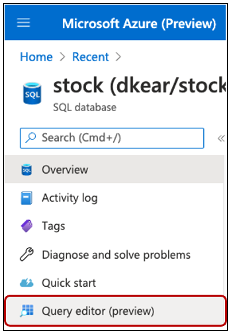
   
   2. Login to your SQL server through SQL server authentication

   3. Copy the T-SQL query below and paste in the query editor
      ```
      CREATE TABLE Stock ( 
          color varchar(255), 
          num_box int, 
      ); 
      ``` 

   4. Run the Query to create the stock table 

      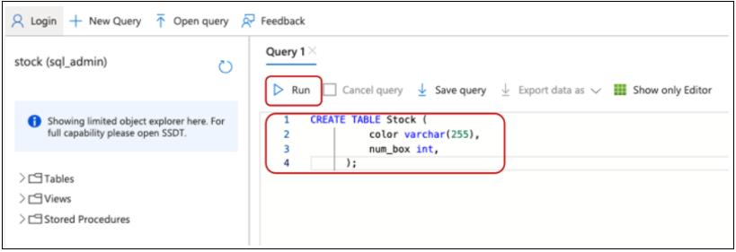

#### 4. Visit the [azure-functions folder](https://github.com/leannhuang/voice-control-inventory-management/tree/main/azure-functions) to create a local Azure function project in Python and publish your function code to Azure 

#### 5. Visit the [custom commands folder](https://github.com/leannhuang/smart-plug-with-custom-commands/tree/main/custom-commands) to complete setting up the custom commands of the smart stock (Note down the `Application ID`, `Speech resource key`, and `region`)

#### 6. Create a file named `.env` in this folder based on `envtemplate` in the VS code. Provide values for all variables.
      
   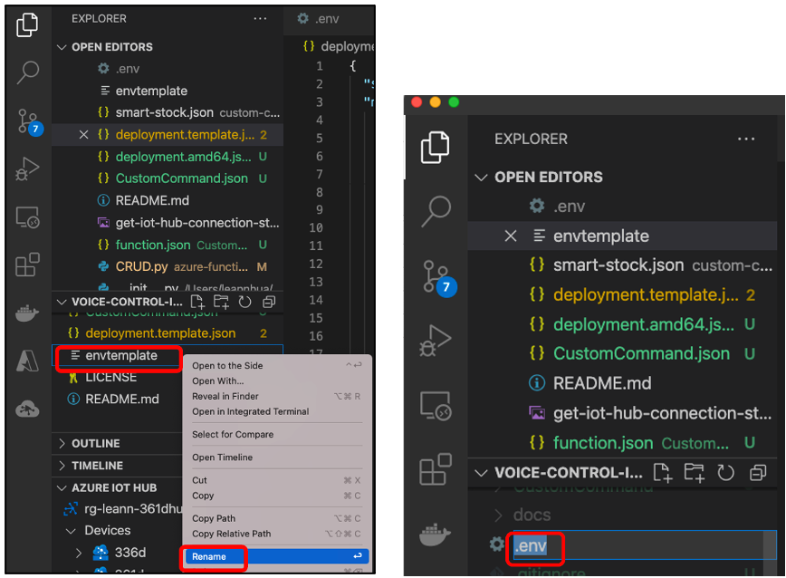

#### 7. Deploy edge modules on your edge device (Note: The edge modules run on devkit will be replaced by the edge modules defined in the `deployment.template.json`)
   1. In the Visual Studio Code explorer, right-click the `deployment.template.json` file and select Generate IoT Edge Deployment Manifest.
        
        

   2. Use VSCode as in [here](https://docs.microsoft.com/en-us/azure/iot-edge/tutorial-develop-for-linux?view=iotedge-2020-11#deploy-modules-to-device) to deploy the modules to the Percept DK with the above files.

#### 8. Import dataset from Azure SQL to Power BI 
   1. Open the Power BI Desktop and import data from Azure SQL Server
      1. Click close of the pop-up window
      2. Import data from SQL Server

         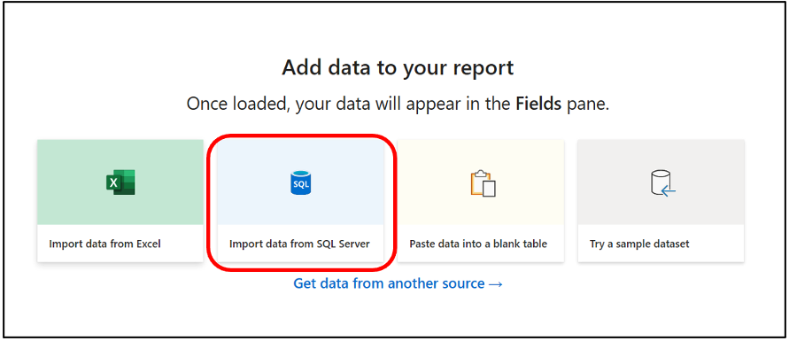

      3. Enter your sql server name <your sql server name>.database.windows.net, and choose DirectQuery

         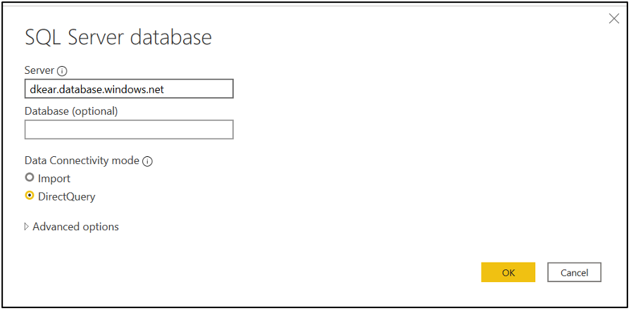

      4. Select Database, and enter the username and the password

         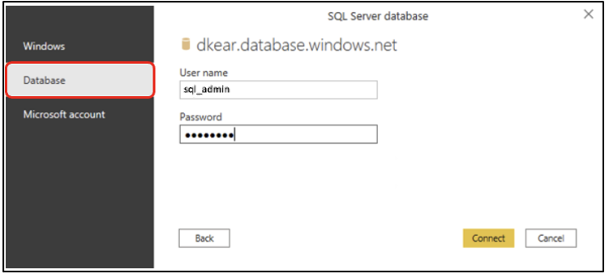

      5. Select the table Stock, and Click Load to load dataset to Power BI Desktop

         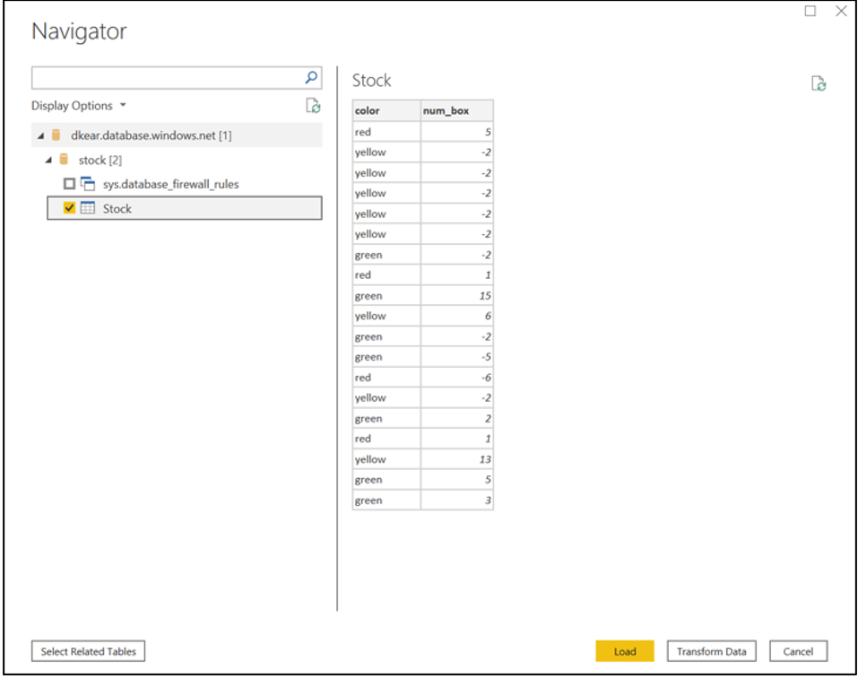
   
   2. Create your Power BI Report
      1. Click color, num_box columns in the Fields. And choose visualization Clustered column chart to present your chart.

         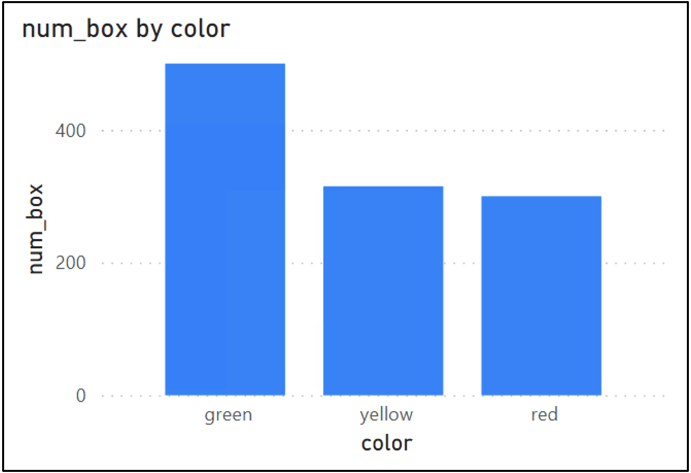

      2. Drag and drop the color column to the Legend and you will get the chart that looks like below. 
         
         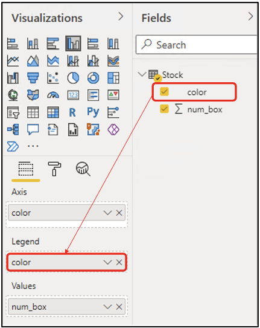

         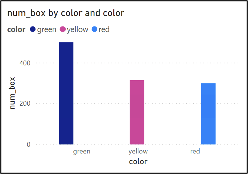

      3. Click format and click Data colors to change the colors accordingly. You will have the charts that look like below.

         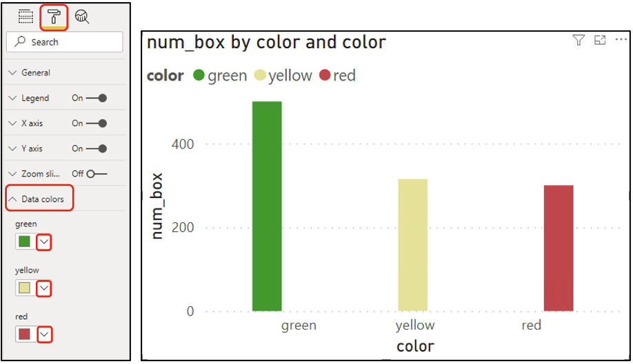

      4. Select card visualization

         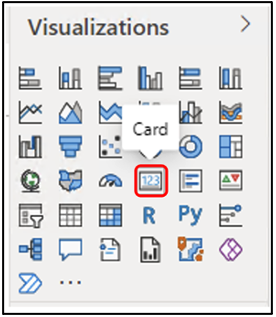

      5. Check the num_box

         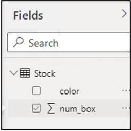

      6. Drag and drop the color column to Filters on this visual

         

      7. Select green in the Filters on this visual

         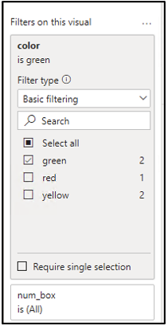

      8. Double click the column name of the column in the Fields and change the name of the column from “Count of the green box”

         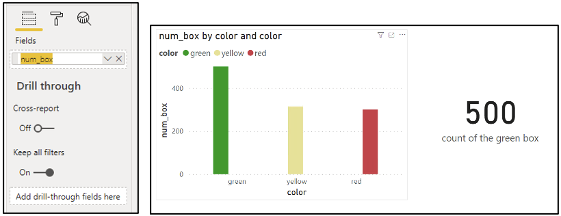
   
   3. Speak command to your Devkit and refresh Power BI
      1. Speak “Add three green boxes” to Azure Percept Audio
      2. Click “Refresh”. You will see the number of green boxes has been updated.

         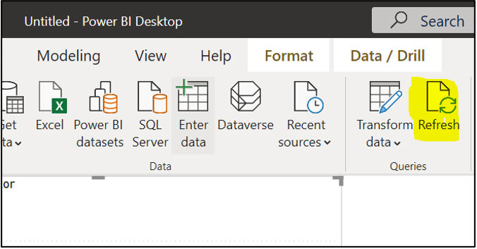

## Other Info
### Get your IoT Hub connection string
1. Go to IoT Hub service in Azure Portal. Click Shared access policies -> Iothubowner  
2. Click Copy the get the primary connection string 
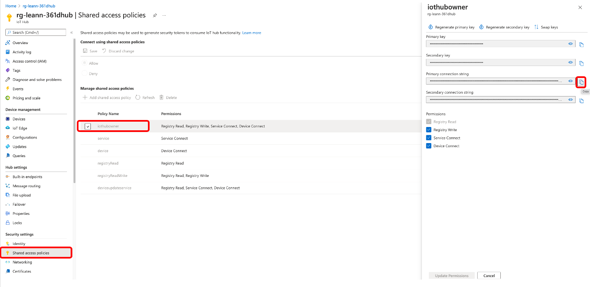
