# Deploy your Azure function as web service
Use this folder to create a local Azure Functions project in Python and publish your function code to Azure

## Content
| File             | Description                                                   |
|-------------------------|---------------------------------------------------------------|
| `readme.md`             | This readme file                                              |
| `__init__.py`    | The runtime expects the method to be implemented as a global method called main() in the __init__.py file |
| `CRUD.py`    | The method to create/read/update/delete the records in SQL server database |
| `requirements.txt`    | List of all dependent Python libraries |

## Steps
#### 1. Click "..." and check the “Functions” has been checked 
   
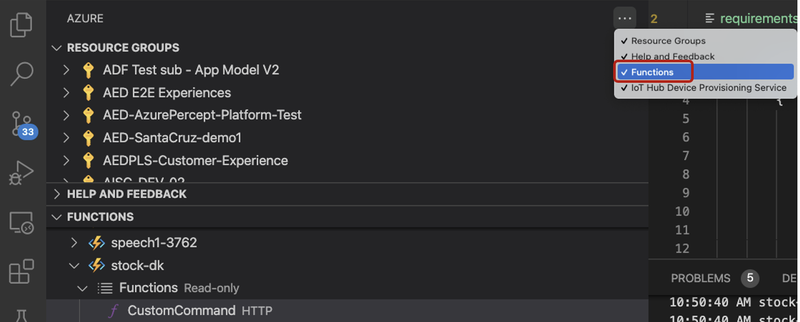

#### 2.  Create a folder (ex: airlift_az_func) for your project workspace
   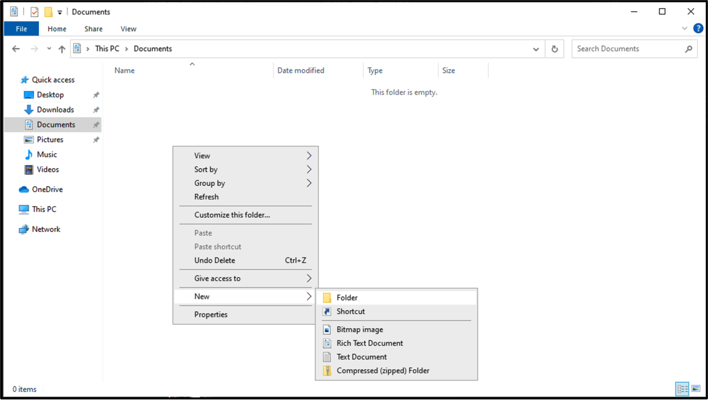

#### 3. Create your local project [here](https://docs.microsoft.com/en-us/azure/azure-functions/create-first-function-vs-code-python#create-an-azure-functions-project)
   
   Note: 
   1. Select a Python alias to create a virtual environment: Choose the location of your Python interpreter. If the location isn't shown, type in the full path to your Python binary. Select skip virtual environment you don’t have python installed
      
      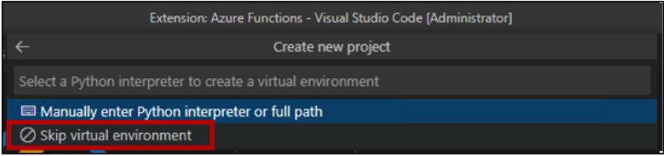

#### 4. Develop CRUD.py to update Azure SQL on Azure Function
   1. Replace the content of the __init__.py in [here](https://github.com/leannhuang/voice-control-inventory-management/blob/main/azure-functions/__init__.py) by copying the raw content of the __init__.py 
      
      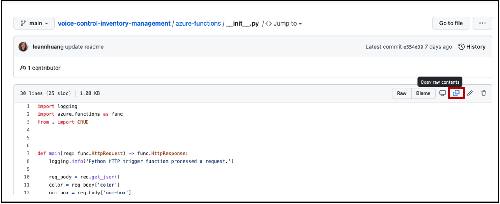

   2. Drag and drop the CURD.py to the same layer of the __init__.py

      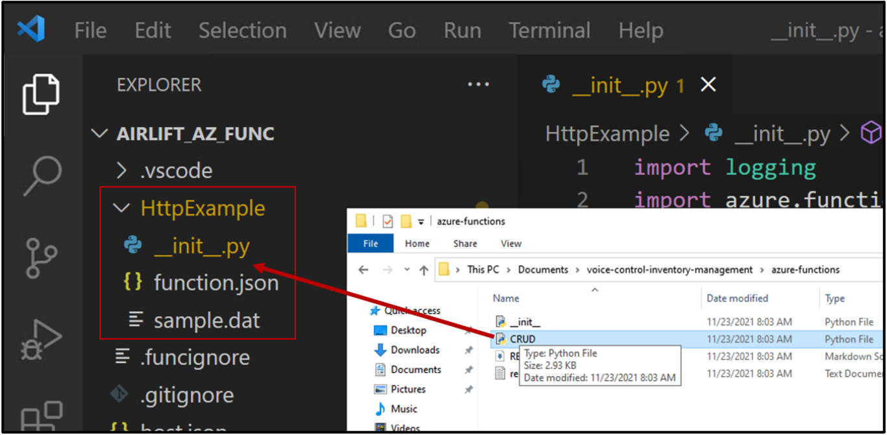

      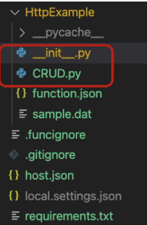

   3. Update the sql server, database, username, password in CRUD.py

      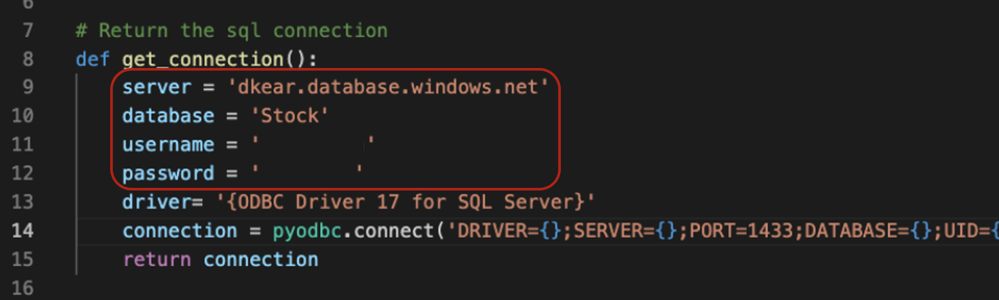

   4. Replace the content of the requirements.txt in [here](https://github.com/leannhuang/voice-control-inventory-management/blob/main/azure-functions/requirements.txt) by copying the raw content of requirements.txt

#### 5. Sign in to Azure [here](https://docs.microsoft.com/en-us/azure/azure-functions/create-first-function-vs-code-python#sign-in-to-azure)
#### 6. Publish the project to Azure [here](https://docs.microsoft.com/en-us/azure/azure-functions/create-first-function-vs-code-python#publish-the-project-to-azure)
   1. Select a runtime: Choose the version of 3.9 
   2. Note down the URL for further use
   
      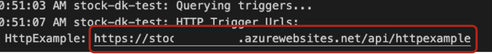

#### 7. Test your Azure Function App
   1. Select the Azure icon in the Activity bar. In the Azure: Functions area, select the Deploy to function app... button.
   
   2. Right-click the HttpExample function and choose Execute Function Now....
   
      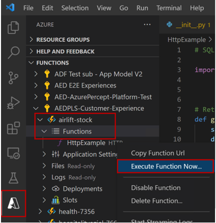

   3. In Enter request body you see the request message body value of
            
      ```
      { "color": "yellow", "num_box" :"2", "action":"remove" } 
      ```
      
      Press Enter to send this request message to your function.
      
      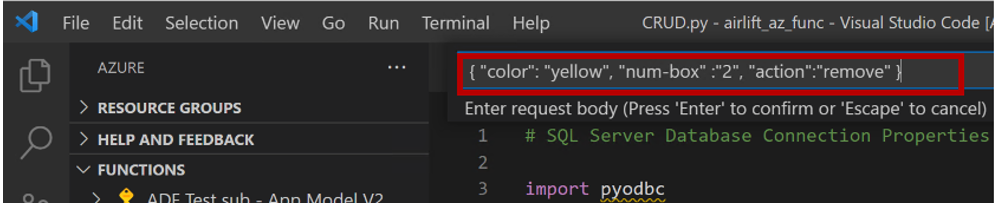
   
      When the function executes in Azure and returns a response, a notification is raised in Visual Studio Code.

      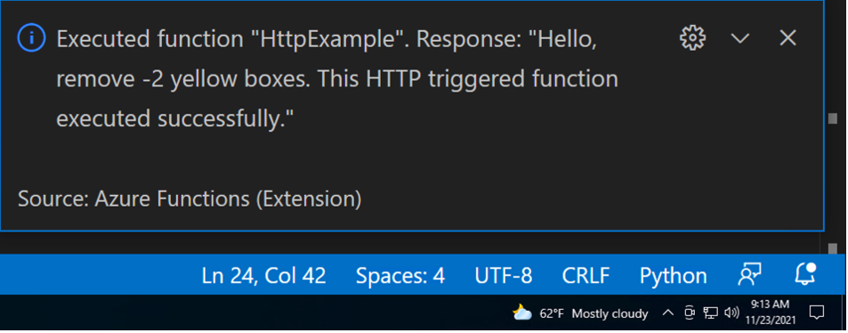

   4. Check if the records in your database has been updated 


## Credits and references
- [Create a function in Azure with Python using Visual Studio Code](https://docs.microsoft.com/en-us/azure/azure-functions/create-first-function-vs-code-python#publish-the-project-to-azure) 

