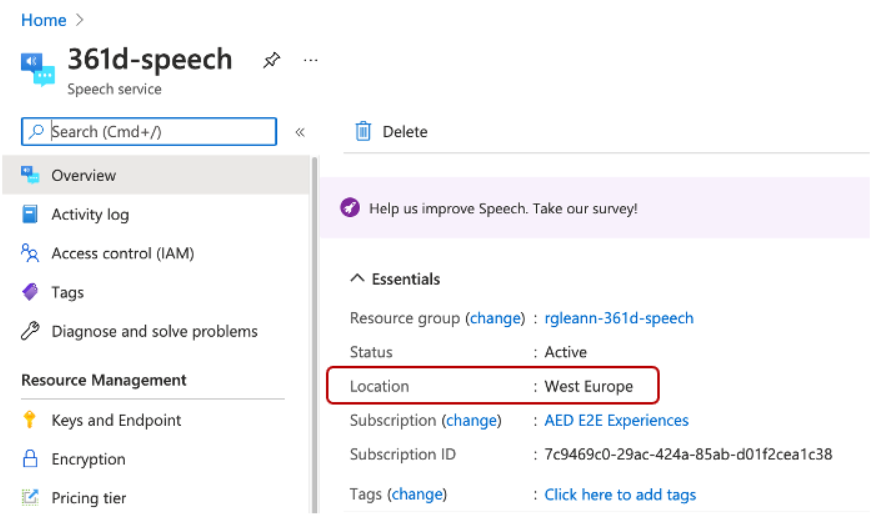
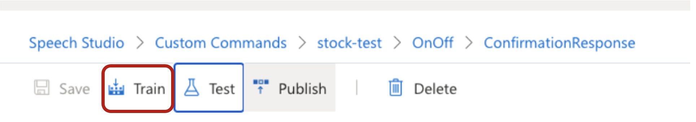
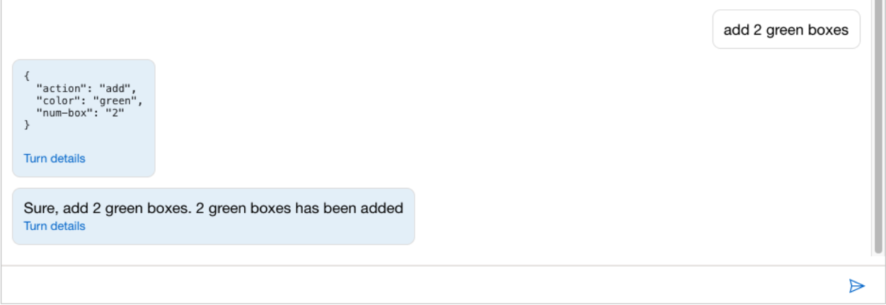
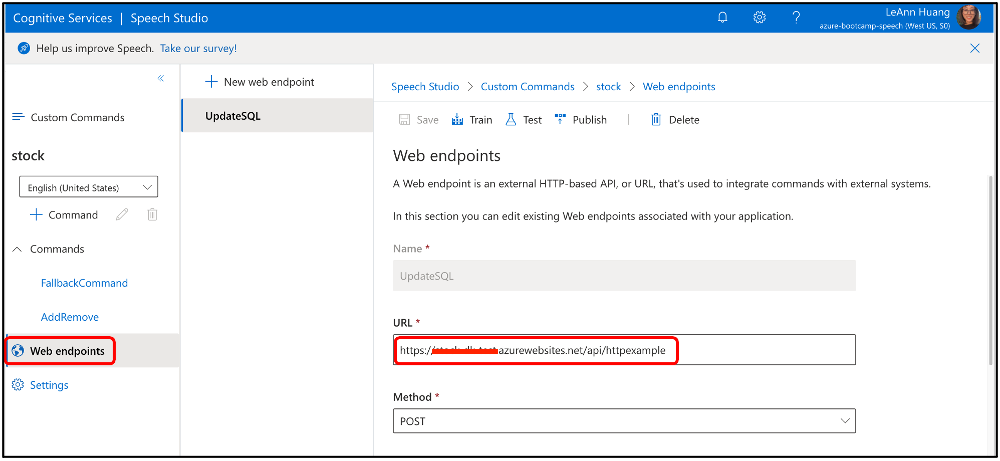
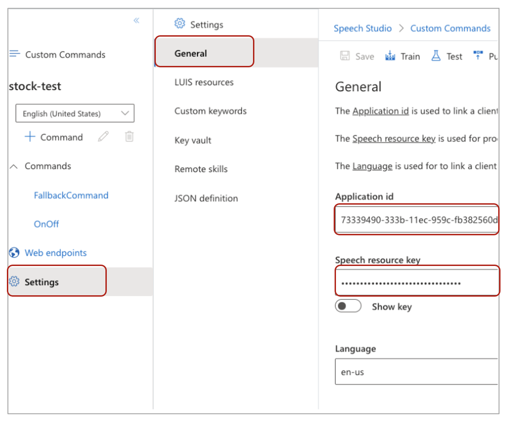

# Custom Commands Deployment
Use this folder to deploy smart plug custom commands on your speech studio

## Content
| File             | Description                                                   |
|-------------------------|---------------------------------------------------------------|
| `smart-stock.json`       | The configuration of the smart stock custom commands           |
| `readme.md`     | This readme file   |

## Example sentences
Here are a few examples. Try these or others of your choice:

```
Add three green boxes
Remove two red boxes
```

## Deploy and note down the `Application ID` and `Speech resource key` value

#### 1. Follow the guidance [here](https://github.com/MicrosoftDocs/azure-docs/blob/master/articles/cognitive-services/Speech-Service/quickstart-custom-commands-application.md#go-to-the-speech-studio-for-custom-commands) to import the `smart-stock.json` file

#### 2. Note down the `region` of the resource you created above and mapping the [name](https://azuretracks.com/2021/04/current-azure-region-names-reference/) for further use 



#### 3. Try out some voice command 
   1. Select Train at the top of the right pane

        


   2. Once training is completed, select Test and try out the following utterances:
        ```
        Add three green boxes
        Remove two red boxes
        ```
   3. Check the respone in the Test window
        
        

#### 4. Replace the web endpoints URL
  1. Click Web endpoints and replace the URL
  2. Replace the value in the URL to the HTTP Trigger Url you noted down when you published the Azure function app
     
     

#### 5. Update prediction LUIS resource [here](https://github.com/MicrosoftDocs/azure-docs/blob/master/articles/cognitive-services/Speech-Service/quickstart-custom-commands-application.md#update-prediction-luis-resource)

#### 6. Publish the application [here](https://github.com/MicrosoftDocs/azure-docs/blob/master/articles/cognitive-services/Speech-Service/quickstart-custom-commands-application.md#publish-the-application)

#### 7. Select `Settings` --> `General` to note down the `Application ID` and `Speech resource key` for further useapp



## Credits and references
- [Create a voice assistant using Custom Commands](https://github.com/MicrosoftDocs/azure-docs/blob/master/articles/cognitive-services/Speech-Service/quickstart-custom-commands-application.md#publish-the-application) 